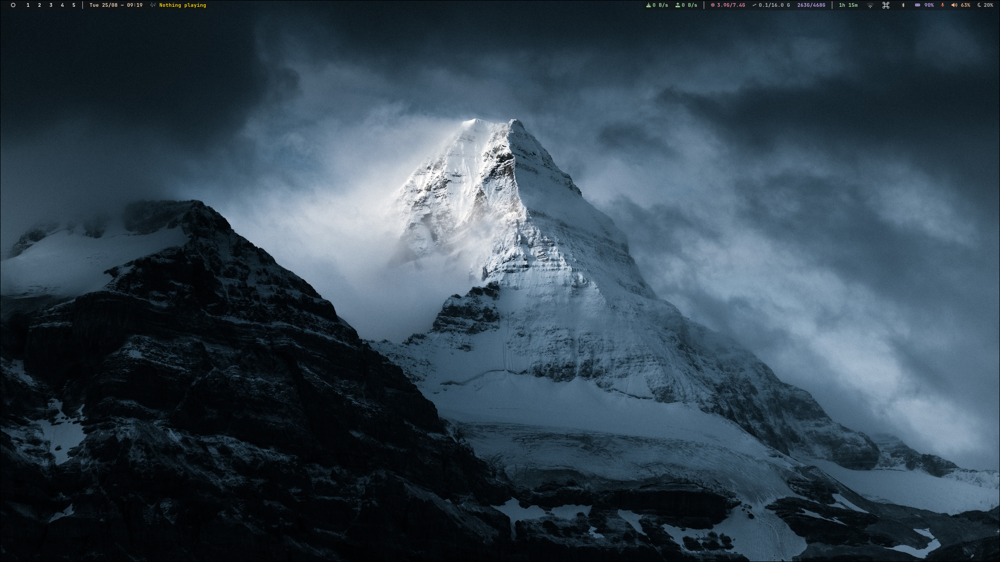
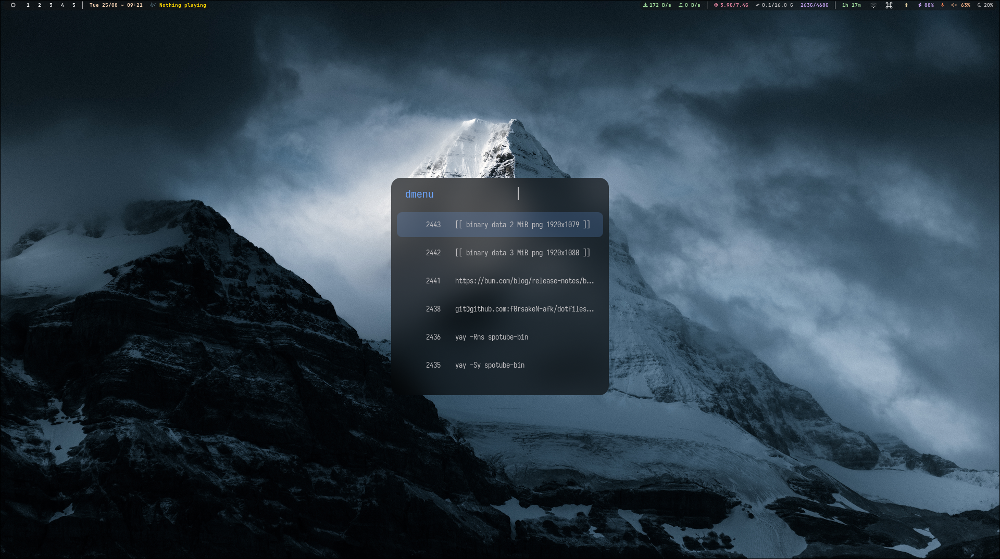
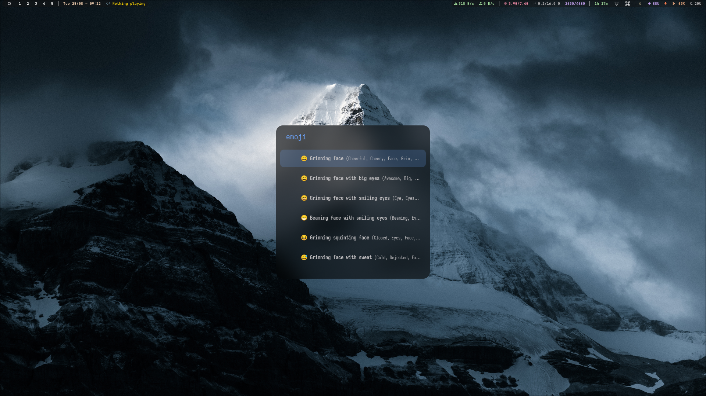
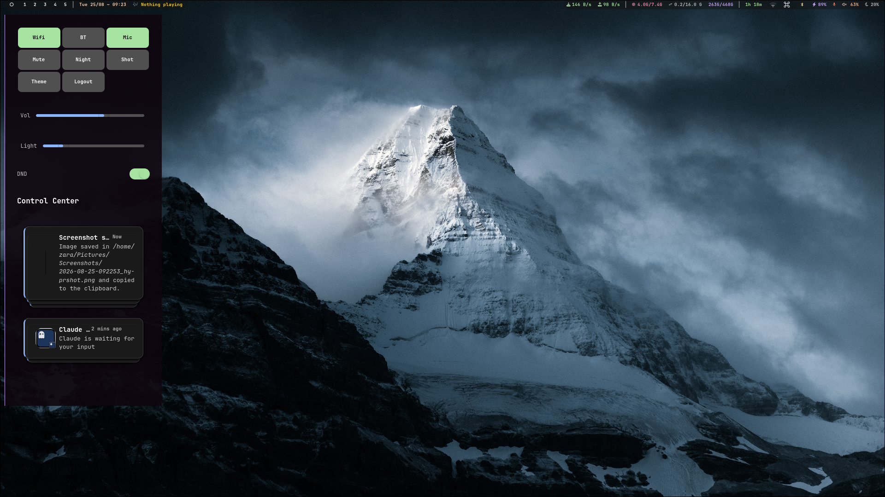
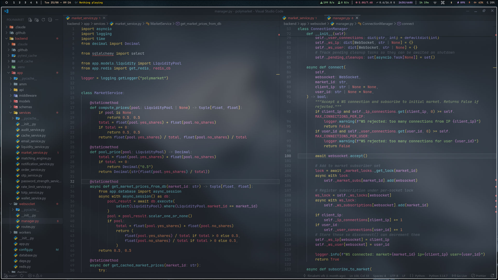

# dotfiles

Personal rice configs — Hyprland, ghostty, zsh, neovim, tmux, waybar, and more.

## what's included

| app | what |
|-----|------|
| Hyprland | window manager |
| ghostty | terminal |
| zsh + ohmyposh | shell + prompt |
| neovim | editor |
| tmux | multiplexer |
| waybar | status bar |
| rofi | app launcher |
| swaync | notifications |
| wlogout | logout menu |
| cava | audio visualizer |
| naresh/ | personal scripts |

## setup

```bash
# clone
git clone https://github.com/YOUR_USER/dotfiles.git ~/dotfiles
cd ~/dotfiles

# install deps (arch)
sudo pacman -S hyprland ghostty neovim tmux waybar rofi wlogout cava

# symlink with stow
stow .config

# or manually
ln -sf ~/.config/naresh ~/.config/naresh
```

## structure

```
.dotfiles/
├── .config/
│   ├── naresh/        # personal scripts (kumari-start/stop, wallpaper scripts)
│   ├── hypr/          # Hyprland config
│   ├── ghostty/       # ghostty terminal
│   ├── nvim/          # Neovim
│   ├── rofi/          # Rofi
│   ├── swaync/        # Sway notification daemon
│   ├── waybar/        # Waybar
│   └── wlogout/       # Wlogout
├── .tmux.conf
└── .zshrc
```

## personal scripts (naresh/)

- `wallpaper_random.sh` — random wallpaper
- `wallpaper_select.sh` — pick wallpaper

## apply tmux plugins

```
tmux
prefix + I  # install plugins
```

## screenshots







